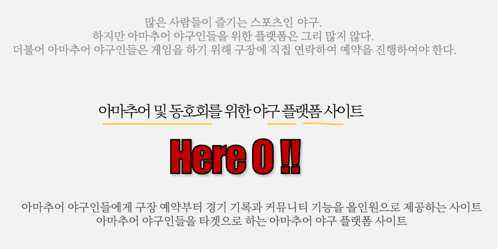

# KH 프로젝트 정리

# HERE O - Final Project

## 1. 사이트 기획 의도

---

<aside>
💡 아마추어 야구인들의 편의를 증진 시키고자 구장 예약 및 경기 기록 관리, 커뮤니티 기능을 갖춘 사이트 개발하고자 하였다.

</aside>

## 2. 선행 사이트 분석

---

|  | 퍼즐 풋볼 | 게임원 | 세컨드 그라운드 |
| --- | --- | --- | --- |
| 특징 | 플레이어 단위의 기록 | 가장 활발히 운영되는 사이트 | 다양한 종목 수용 |
| 장점 | 깔끔한 UI/UX, 랭킹 시스템 활발, 매치 참여 후기 시스템 | 운영이 잘 됨. 세세한 부분까지 완성도 높음 | 깔끔한 UI/UX, 세세한 경기 결과 분석 |
| 단점 | 팀 단위 활동 부재,  | x | 실제 홈페이지 운영X, 경기 결과 분석의 연속성 X |
| 주소 | 현재 사이트 폐쇄 | http://gameone.kr/ | http://bacving.com/user/index |

## 3. 설계의 주안점

---

1. 종합 아마추어 야구 플랫폼으로서의 기능 추구
    1. 팀 등록, 구장 예약, 경기 기록, 커뮤니티 기능을 통해 아마추어 야구 경기를 시작부터 끝까지 지원하는 종합 아마추어 야구 플랫폼 사이트의 기능
2. 야구 경기 데이터 관리
    1. 하나의 경기를 기록하기 위해서 야구 경기를 세부 단위로 나누어 기록할 수 있게 구성 
    2. 야구 경기 기록 데이터를 경기-이닝-타석 단위로 구분
        1. 경기 기록 : 한 경기의 기록
        2. 이닝 : 경기가 진행된 이닝(1~9, 선후공)
        3. 타석 : 이닝 동안 진행된 타석의 이벤트
    3. 각 단위로 구분하여, 경기 기록을 보다 정합하게 기록 할 수 있도록 설계
3. 경기 예약 → 경기 수행 → 기록 도출로 이어지는 통합적 관리
    1. 경기를 예약한 시점부터 실제 경기가 끝나고 경기의 기록이 산출될 때까지 통합적 관리 제공

## 4. 요구 사항 개발 및 관리

---

- 각 페이지 요구사항을 미리 작성하며, 작업 진행의 지침으로 삼고 개발하고자 함.
    - 팀원 별로 각 담당 부분에 대한 요구사항을 작성하고, 다른 팀원이 피드백 하는 형식으로 수행
- 그러나 개발 과정에서 참고하기는 했으나, 변경된 사항을 지속적으로 반영하지 않은 부분이 있었다.

## 5. DB 설계

---

- ERD Cloud를 통한 DB 설계 및 관리

## 6. 전체 사이트 서비스 기능

---

굵은 글씨로 된 부분이 제가 담당한 영역입니다.

- 메인 페이지
    - 실시간 예약 바로가기 서비스
    - 새로운 팀 창단시 알려주는 서비스
- **팀 페이지**
    - **팀 생성 및 관리**
        - **팀 창설**
        - **팀 가입**
    - **팀 경기 일정 관리**
        - **팀 경기 일정 확인**
        - **팀 예약 경기 라인업 제출**
    - **팀 선수 정보 관리**
        - **팀 선수 조회**
        - **팀 선수 정보 수정**
        - **팀 선수 상세 열람**
            - **일자별 성적 조회**
            - **년도 성적 조회**
    - **팀 커뮤니티 기능**
        - **팀 게시판**
- **경기 기록 페이지**
    - **경기 입력 및 조회**
        - **경기 결과 입력**
            - **경기 총 이닝 선택**
            - **이닝 시작 팀 선택**
            - **기록 선수 추가**
            - **기록 선수 세팅(타순, 선수, 수비, 구분)**
            - **이닝별 경기 기록 입력**
        - **경기 결과 조회**

- 리그 페이지

- 예약 페이지
    - **구장 등록 기능, 경기 예약 기능, 구장 리스트 조회, 예약 확인**

- 커뮤니티 페이지
    - 글 등록, 수정 및 삭제하기 기능, 검색 기능
    - 태그별 리스트 조회 기능, 조회수 상위 컨텐츠 조회 기능

## 7. 팀 내 역할

---

- 팀 내 포지션 : 팀장
    - 팀장으로 전체적 일정 관리, 진행 계획, 전체 코드 관리 등을 수행
    - 의사 결정 과정에 적극적으로 참여하고 해당 결정 과정과 내역들을 기록
    - 프로젝트 마감 전 결원과 팀원의 역량 분제로 구현하지 못한 부분을 대신 작업
- 담당 페이지
    - 팀 페이지 영역 전체 구현(Front/Back)
        - 팀 페이지를 전담하여 구현.
    - 경기 기록 페이지 및 경기 예약 페이지 프론트 및 백앤드 구현
        - 프로젝트 진행 중 여러 인적 이슈들이 발생하여, 해당 영역들을 대신 구현하였습니다.
        - 타 팀원의 작업 내용을 이어받아, 기능 구현에 필요한 프론트 요소와 백앤드 전체 작업
- DB 관리 및 설계
    - 팀원 별로 각 담당 파트에 대한 데이터베이스 도메인을 설계하고, 해당 내용을 최종적으로 팀장인 제가 확인하며 수정 및 반영하였습니다.
    - 팀 페이지에 관련된 전체 도메인 구성과 야구 경기 기록을 위한 도메인 설계를 전담
        - 팀 - 선수 - 회원의 관계와 야구 경기를 경기-이닝-타석으로 나누고, 경기 계획과 실제 경기 수행 기록을 나누어 관리하는 구조를 제시했습니다.
    - MySQL 데이터 관리 및 DB 데이터 관리
        - 트리거, 프로시저 관리

## 8. 개발 환경

---

## 9. 작업, 일정 및 변경 관리

---

### 9-1. 프로젝트 일정 관리

- 노션을 통해 프로젝트 전체 일정을 관리 및 계획

### 9-2. 작업 사항 관리

- 노션을 통해 일자별 프로젝트 작업 내역 및 수행 진척도를 관리
- 작업을 진행 단계별로 나누어 관리할 수 있도록 함.
    - 그러나 초기에 약간 사용되고 나중에는 거의 사용되지 않음.

### 9-3. 변경 사항 관리

- 개인별 변경 사항을 노션을 통해 관리하여, 팀원들 간에 공유할 수 있도록 관리
- 변경사항 등록 → 도입 논의 → 변경 사항 반영 의 프로세스 구축
    - 프로젝트 끝까지 사용되긴 하였으나, 사용 하는 사람만 사용하는 식으로 진행됨.

## 10. 기능 시연 이미지

